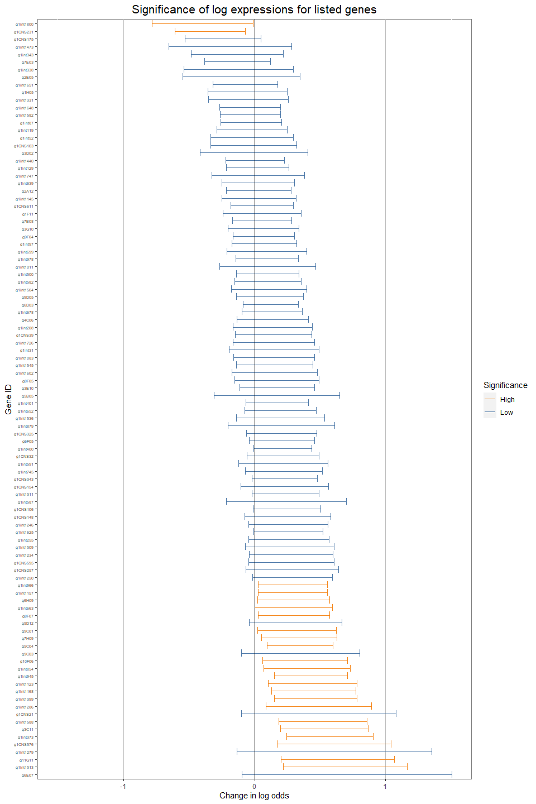

# Purpose of the repository

This repository showcases how Rstudio can be used to create a quick and
reproducible study for certain datasets in bio data science.

## Installation and reproducibility

OS: Windows 11 R version: 4.3.1 install RTools \> 4.3 :
<https://cran.r-project.org/bin/windows/Rtools/>

## Run the analysis and use the data

The scripts in augment_data download the gravier dataset and transpose
using pivotting to have the genes listed on the y axis. The output of
this processing step is a data table with 100 randomly chosen genes,
their expression values and the outcome of the corresponding sample. You
can set a seed to control the reproducibility of your analysis. <b>

``` r
source("augment_data/run_full_augmentation.R")
```


``` r
chosen_genes <- choose_genes_rand(set_seed = 123)
```

``` r
head(chosen_genes)
```

    ## # A tibble: 6 × 3
    ##   outcome gene    expression
    ##     <dbl> <chr>        <dbl>
    ## 1       0 g1F11      0.00288
    ## 2       0 g1H05     -0.0908 
    ## 3       0 g1int31    0.0655 
    ## 4       0 g9C03      0.0101 
    ## 5       0 g2E05     -0.00868
    ## 6       0 g6E07     -0.0454
    

### Analyse the significance of the genes for an output
<b>

For each of the previously selected genes 168 samples were taken which
contain now the log expression values and an output originally labelled
as poor or good where poor indicates early mestastasis after diagnosis
and no symptoms were detected for samples labelled with good. The impact
of the chosen genes independently of a specific outcome was calculated
by applying a logistic regression on the expression values given the
outcome for a certain gene. The p value (p \< 0.05 indicates
significance )of the model was used to label the significance of the
gene for an outcome in the plot. To sum up, this plot can be used to
identify genes which might have an important role for preventing or
inducing metastasis.
<b>

``` r
source("plots/forest_plot.R")
forest_plot <- create_forest_plot(chosen_genes)
```


``` r
print(forest_plot)
```



## References

Gravier dataset from: <https://github.com/ramhiser/datamicroarray>
